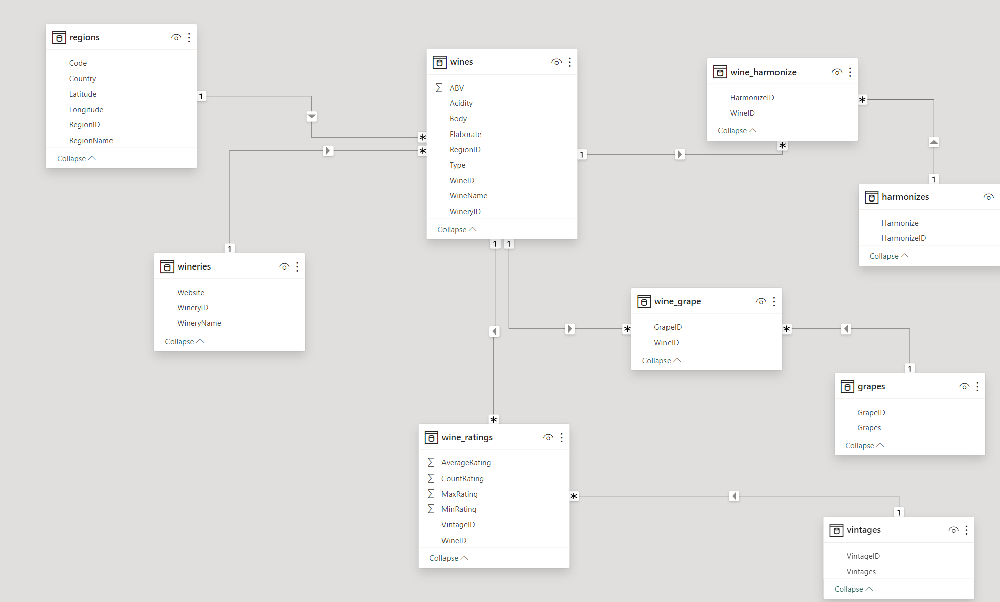

# Wine API
## Table of Contents
- [Wine API](#wine-api)
  - [Table of Contents](#table-of-contents)
- [Introduction](#introduction)
- [Prerequisites](#prerequisites)
- [Entity Relationship Diagram](#entity-relationship-diagram)
- [API Documentation](#api-documentation)
  - [Wine](#wine)
  - [Region](#region)
  - [Winery](#winery)
  - [Compare](#compare)
  - [Predict](#predict)
- [How to run](#how-to-run)
- [Contributing](#contributing)
- [Acknowledgement](#acknowledgement)

# Introduction
This is an API for our research in Wine Analysis and Prediction. The API is used to predict the quality of wine based on the input parameters. The API is built using [Django](https://www.djangoproject.com/). 
We use [Postgres](https://www.postgresql.org/) as our database. We also use [Redis](https://redis.io/) as our cache database.

# Prerequisites
- [Python](https://www.python.org/) 3.9 or above
- [Docker](https://www.docker.com/)
- [Docker Compose](https://docs.docker.com/compose/)
- [Postgres](https://www.postgresql.org/)
- [Redis](https://redis.io/)

# Entity Relationship Diagram

*Entity Relationship Diagram*

# API Endpoint
Here is the table of the API endpoint. You can also see the documentation after running the API on [Swagger](http://localhost:8000/doc/).

## Wine
Base URL: http://localhost:8000/api/v1/wines

<table>
  <tr>
    <th>Endpoint</th>
    <th>Full path</th>
    <th>Method</th>
    <th>Description</th>
    <th>Parameters</th>
    <th>Body</th>
  </tr>

<tr>
  <td rowspan="2">/</td>
  <td rowspan="2"><code>/?page=%s&page_size=%s</code></td>
  <td rowspan="2">GET</td>
  <td rowspan="2">If you don't give page and page_size, 10 wines in 1st page will be returned</td>
  <td>page (optional, default 1)</td>
  <td rowspan="2"></td>  
</tr>
  <tr>
    <td>page_size (optional, default 10)</td>
  </tr>
  

<tr>
  <td rowspan="8">/</td>
  <td rowspan="8"><code>/</code></td>
  <td rowspan="8">POST</td>
  <td rowspan="8">Create a new wine</td>
  <td rowspan="8"></td>
  <td>wine_name (mandatory)</td>
</tr>
  <tr>
    <td>type (mandatory; Red, White, Rose, Sparkling)</td>
  </tr>
  <tr>
    <td>winery (mandatory; int, id of winery in the DB)</td>
  </tr>
  <tr>
    <td>region (mandatory; int, id of region in the DB)</td>
  </tr>
  <tr>
    <td>elaborate (optional)</td>
  </tr>
  <tr>
    <td>abv (optional)</td>
  </tr>
  <tr>
    <td>body (optional)</td>
  </tr>
  <tr>
    <td>acidity (optional)</td>
  </tr>

<tr>
  <td>/{id}/</td>
  <td><code>/{id}/</code></td>
  <td>GET</td>
  <td>Get a wine by id in the database (Not X-Wines id)</td>
  <td></td>
</tr>

<tr>
  <td rowspan="8">/{id}/</td>
  <td rowspan="8"><code>/{id}/</code></td>
  <td rowspan="8">PUT</td>
  <td rowspan="8">Update a wine by id in the database (Not X-Wines id)</td>
  <td rowspan="8"></td>
  <td>wine_name (optional)</td>
</tr>
  <tr>
    <td>type (optional; Red, White, Rose, Sparkling)</td>
  </tr>
  <tr>
    <td>elaborate (optional)</td>
  </tr>
  <tr>
    <td>abv (optional)</td>
  </tr>
  <tr>
    <td>body (optional)</td>
  </tr>
  <tr>
    <td>acidity (optional)</td>
  </tr>
  <tr>
    <td>winery (optional; int, id of winery in the DB)</td>
  </tr>
  <tr>
    <td>region (optional; int, id of region in the DB)</td>
  </tr>

<tr>
  <td>/{id}/</td>
  <td><code>/{id}/</code></td>
  <td>DELETE</td>
  <td>Delete a wine by given id</td>
  <td></td>
  <td></td>
</tr>

<tr>
  <td rowspan="10">/filter/</td>
  <td rowspan="10"><code>/filter/?page=%s&page_size=%s</code></td>
  <td rowspan="10">GET</td>
  <td rowspan="10">Filter wines by given parameters</td>
  <td>page (optional, default 1)</td>
  <td rowspan="10"></td>
</tr>
  <tr>
    <td>page_size (optional, default 10)</td>
  </tr>
  <tr>
    <td>wine_name (optional)</td>
  </tr>
  <tr>
    <td>type (optional; Red, White, Rose, Sparkling)</td>
  </tr>
  <tr>
    <td>elaborate (optional)</td>
  </tr>
  <tr>
    <td>abv (optional)</td>
  </tr>
  <tr>
    <td>body (optional)</td>
  </tr>
  <tr>
    <td>acidity (optional)</td>
  </tr>
  <tr>
    <td>winery_id (optional; int, id of winery in the DB)</td>
  </tr>
  <tr>
    <td>region_id (optional; int, id of region in the DB)</td>
  </tr>
</table>

## Region
Base URL: http://localhost:8000/api/v1/regions

## Winery
Base URL: http://localhost:8000/api/v1/wineries

## Compare
Base URL: http://localhost:8000/api/v1/compare

<table>
  <tr>
    <th>Endpoint</th>
    <th>Full path</th>
    <th>Method</th>
    <th>Description</th>
    <th>Parameters</th>
    <th>Body</th>
  </tr>

<tr>
  <td rowspan="3">/compare_wine/</td>
  <td rowspan="3"><code>/compare_wine/?wine_id=%s...</code></td>
  <td rowspan="3">GET</td>
  <td rowspan="3">Get a list of wines that have similar characteristics with the given wine</td>
  <td>wine_id (mandatory, reference <code>wine_id</code> to compare)</td>
  <td rowspan="3"></td>
</tr>
  <tr>
    <td>vintage (mandatory, reference <code>vintage</code> to compare, between 1950 and 2021)</td>
  </tr>
  <tr>
    <td>nb_wines (optional, default: 10)</td>
  </tr>
</table>

## Predict
Base URL: http://localhost:8000/api/v1/predict

<table>
  <tr>
    <th>Endpoint</th>
    <th>Full path</th>
    <th>Method</th>
    <th>Description</th>
    <th>Parameters</th>
    <th>Body</th>
  </tr>

<tr>
  <td rowspan="5">/forecast_weather/</td>
  <td rowspan="5"><code>/forecast_weather/?region_id=%s...</code></td>
  <td rowspan="5">GET</td>
  <td rowspan="5">Forecast a weather field (avg_temperature, avg_humidity ...) of a region</td>
  <td>region_id (mandatory)</td>
  <td rowspan="5"></td>
</tr>
  <tr>
    <td>predict_field (mandatory; avg_temperature, avg_humidity, avg_pressure, avg_wind_speed, avg_precipitation)</td>
  </tr>
  <tr>
    <td>nb_months (mandatory; int, number of months to forecast, recommend to read TimeGPT doc)</td>
  </tr>
  <tr>
    <td>frequency (mandatory; Ex: MS, DS, recommend to read TimeGPT doc)</td>
  </tr>
  <tr>
    <td>api_key (mandatory; API key of Nixtlats TimeGPT)</td>
  </tr>

<tr>
  <td rowspan="3">/predict_rating/</td>
  <td rowspan="3"><code>/predict_rating/?wine_id=%s...</code></td>
  <td rowspan="3">GET</td>
  <td rowspan="3">Predict average rating of a batch wine in a specific year</td>
  <td>wine_id (mandatory)</td>
  <td rowspan="3"></td>
</tr>
  <tr>
    <td>batch_vintage (optional, default: 2023)</td>
  </tr>
  <tr>
    <td>rating_year (mandatory)</td>
  </tr>

<tr>
  <td rowspan="2">/predict_all_rating/</td>
  <td rowspan="2"><code>/predict_all_rating/?wine_id=%s&rating_year=%s</code></td>
  <td rowspan="2">GET</td>
  <td rowspan="2">Predict average rating in <code>rating_year</code> from the batch vintage from 1949 to 2023</td>
  <td>wine_id (mandatory)</td>
  <td rowspan="2"></td>
</tr>
  <tr>
    <td>rating_year (optional, default: 2023)</td>
  </tr>
</table>

# How to run
1. Clone this repository
```bash
git clone https://github.com/5IF-PSAT/wine-api.git
```
2. Pull the docker image
```bash
docker pull nmngo248/wine-api:latest
```
3. Download the local data on the folder `wine_api` on Google Drive
4. Run the docker image
```bash
docker compose up -d
```

Now you can access the API Documentation on http://localhost:8000/doc/

5. Migrate the data to the database, first go inside the `wine-api` container
```bash
docker exec -it wine-api sh
```
Then run the migration command
```bash
python manage.py migrate
```
Exit the container
```bash
exit
```
6. Restart the containers
```bash
docker compose restart
```
7. Stop the containers
```bash
docker compose down
```
If you want to check the tables in the database, go inside the Postgres container
```bash
docker exec -it postgres psql -U postgres --dbname postgres
```
Then check the wine table for instance
```bash
SELECT * FROM wine;
```

# Contributing
- [Minh NGO](mailto:ngoc-minh.ngo@insa-lyon.fr)

# Acknowledgement
- [Nixtlats](https://nixtlaverse.nixtla.io/nixtla/index.html)
- [Tensorflow](https://www.tensorflow.org/)
- [Django](https://www.djangoproject.com/)
- [Django Rest Framework](https://www.django-rest-framework.org/)
- [Docker](https://www.docker.com/)